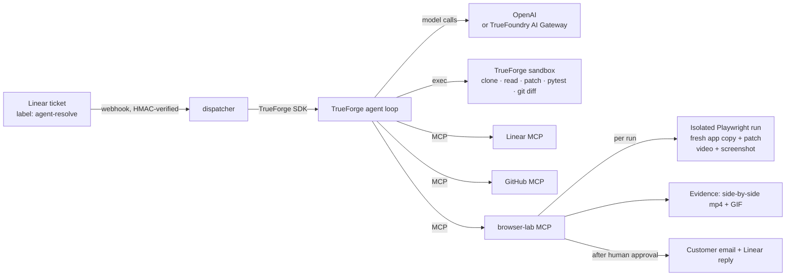

# Show, Don't Tell

**A ticket-resolver agent on [TrueForge](https://github.com/truefoundry/trueforge) that answers every bug report with video proof.**

It picks up a bug ticket from Linear, reproduces the bug in an isolated browser, and records it happening. Then it fixes the code in a sandbox, records the fix working, and opens a PR with a before/after video. It drafts the customer reply and **waits for a human to approve it** before anything goes out. If it can't reproduce the bug, it says so honestly: here's a video of everything it tried, and here's the one question for the customer that would unblock it.


*Real output from the lab: the agent's check fails on the unpatched app, and the lab circles the failure. The same check passes with the patch.*

Built for **Agents That Act** (TrueFoundry × Polaris), theme: Ticket Resolver.

---

## Why

"Can't reproduce" is where support tickets go to die. Support pastes screenshots, engineering asks for steps, the customer gets a vague "should be fixed now". This agent does the tedious part end to end, and **never claims something it can't show**:

| Situation | What the agent returns |
|---|---|
| Bug reproduces | A patch, a PR with a before/after video, and a customer reply with the video, waiting for your approval |
| Bug doesn't reproduce | No patch. A video of every environment it tried, a clearly labelled hypothesis, and one precise question for the customer |
| Ticket tries to manipulate the agent | Ignores the injected instruction, flags it in an internal note, and handles only the real bug |

## How it works



1. **Understand.** Read the ticket. Pick out the steps, what the customer expected, and environment clues ("on my phone" means a mobile viewport). Show a Plan card.
2. **Investigate** in the **TrueForge sandbox**: clone the repo and grep for the relevant code.
3. **Reproduce** in the **browser lab**. The agent writes a Playwright check of the *correct* behaviour. A failing check means the bug is reproduced, and it's recorded to video. The agent tries up to 3 environments.
4. **Fix** in the sandbox and produce a `git diff`. The lab re-runs the *same* check on a fresh copy with the patch applied, and it must now pass.
5. **Prove it.** Build a captioned side-by-side video and GIF. A vision model independently checks the screenshots.
6. **Ship.** Create a branch, push the fix, and call `create_pull_request`. ⏸ **Human approval.**
7. **Reply.** Call `send_customer_reply`. ⏸ **Human approval. Irreversible.**
8. Finish with a **Verdict card**: status, evidence GIF, attempts table, PR, confidence.

## Human checkpoints

| Action | Reversible? | Gate |
|---|---|---|
| Read tickets, clone, grep, run tests, record repro videos | Yes, and isolated | None |
| Internal Linear note, status update | Yes | None |
| **Open a pull request** | Mostly (can be closed) | TrueForge tool approval (`require_approval_for_tools: [create_pull_request]`) |
| **Email the customer + public Linear reply** | **No, can't be unsent** | TrueForge tool approval (`send_customer_reply`, also annotated `destructiveHint: true`). The approval card shows the full draft, recipient and evidence |
| Merge, delete, close tickets | — | Not available to the agent at all |

The agent is told to *call* gated tools rather than ask in chat, so the harness gate always fires. If a human denies a reply, the agent acknowledges it and stops; it doesn't retry.

## Safety: where generated code runs

| Layer | Runs | Isolation |
|---|---|---|
| **TrueForge local sandbox** (built in) | Agent-written shell and Python: clone, edit, `pytest`, `git diff` | macOS seatbelt / Linux bubblewrap via `@anthropic-ai/sandbox-runtime`: writes confined to a per-session directory, network limited to GitHub and PyPI, no host env or secrets |
| **browser-lab** (this repo) | Agent-written Playwright checks against the app | A fresh copy of the app for every run. Node's permission model (the script can only write inside its run directory). Every request outside the app is blocked and reported. Hard timeout |
| **browser-lab, Docker mode** (`LAB_RUNNER=docker`) | Same | A throwaway container: `--network none --read-only --cap-drop ALL --security-opt no-new-privileges`, memory/CPU/pid caps |

Secrets (GitHub, Linear, Resend, model keys) live only in TrueForge and browser-lab. They never enter a sandbox or a prompt.

## Built with TrueForge and TrueFoundry

| Capability | How it's used |
|---|---|
| TrueForge agent spec | `scripts/bootstrap.mjs` creates the `ticket-resolver` agent through the API |
| Sandbox as a tool | All code work runs in TrueForge's sandbox (`exec`) |
| Skills | [`skills/ui-bug-repro`](skills/ui-bug-repro/SKILL.md), git-backed and loaded by TrueForge from this repo |
| MCP connectors | Linear (`mcp.linear.app`), GitHub (`api.githubcopilot.com/mcp`), and our `browser-lab` server |
| Tool approval | Two tiers: PR creation, customer reply |
| Generative UI | Plan card and Verdict card (OpenUI) |
| ask_user_question | When a ticket is too ambiguous to pick a page or feature |
| Sessions + SDK | The dispatcher creates one session per ticket (`metadata.linear_issue`, safe to repeat) |
| **TrueFoundry AI Gateway** (optional) | Set `TFY_GATEWAY_BASE_URL` / `TFY_API_KEY`. The agent and the vision check both go through the gateway, for budgets, rate limits, request logs and cost per ticket |
| **TrueFoundry MCP Gateway** (optional) | Set `TFY_MCP_URL` to a Virtual MCP that combines only the Linear + GitHub tools the agent needs |

---

## Quickstart

**You need:** macOS or Linux, Node ≥ 22.14, **Python ≥ 3.10 as `python3`** (TrueForge's sandbox uses it; on macOS the built-in 3.9 is too old, so `brew install python` and make sure `python3 --version` shows 3.10+), ffmpeg, git, and the GitHub CLI logged in (`gh auth login`). All services are free tier.

```bash
git clone https://github.com/yeah-ssh/show-dont-tell && cd show-dont-tell
cp .env.example .env        # add OPENAI_API_KEY and LINEAR_API_KEY at minimum
npm install
./scripts/start.sh          # starts browser-lab + TrueForge and configures everything
```

Then open **http://localhost:8790**, pick the **ticket-resolver** agent, and type `Resolve DEM-1` (your issue ID).

### Seed demo tickets
```bash
node scripts/seed-linear.mjs                  # 3 tickets: mobile checkout, double coupon, Safari-only
node scripts/seed-linear.mjs --with-injection # plus a ticket that tries to hijack the agent
```
The target app is [yeah-ssh/demo-shop](https://github.com/yeah-ssh/demo-shop), a small storefront built for this project, with real bugs in it.

### Start from Linear automatically (optional)
```bash
npm run dispatcher                              # :8910
cloudflared tunnel --url http://localhost:8910  # public URL for the webhook
```
In Linear → Settings → API → Webhooks, add `<tunnel-url>/linear-webhook` for **Issues** and copy the signing secret to `LINEAR_WEBHOOK_SECRET`. Adding the label `agent-resolve` to an issue now starts the agent.

### Drive a ticket from the terminal
```bash
node scripts/run-ticket.mjs TRU-5                            # stops at each approval (finish in the UI)
node scripts/run-ticket.mjs TRU-5 --approve=create_pull_request # auto-approve the PR, still stop at the reply
```

### Check the lab on its own
```bash
npm run lab                     # :8900
node scripts/lab-smoke.mjs      # desktop pass, mobile repro, patched pass, composed evidence
```

## Configuration

See [`.env.example`](.env.example). The important ones:

| Variable | Purpose |
|---|---|
| `OPENAI_API_KEY`, `AGENT_MODEL` | Model for the agent (default `gpt-5.6-sol`) |
| `TFY_GATEWAY_BASE_URL`, `TFY_API_KEY`, `TFY_AGENT_MODEL` | Route through the TrueFoundry AI Gateway instead |
| `LINEAR_API_KEY` | Linear MCP + reply comments |
| `TARGET_REPO` | The app being fixed (default `yeah-ssh/demo-shop`) |
| `EVIDENCE_REPO` | Public repo where videos and GIFs are published (default `yeah-ssh/show-dont-tell-evidence`) |
| `RESEND_API_KEY`, `REPLY_OVERRIDE_TO` | Real email delivery; the override sends every reply to you during demos |
| `LAB_RUNNER` | `host` (default) or `docker` |

## Demo
See [docs/DEMO.md](docs/DEMO.md) for the 5-minute script and likely judge questions.

## Repo layout
```
agent/instructions.md          agent system prompt
skills/ui-bug-repro/           TrueForge skill: the procedure + reply style
browser-lab/                   MCP server: run_repro, compose_evidence, verify_screens, send_customer_reply
  runner/run.mjs               executes one agent-written Playwright check (isolated child process)
  Dockerfile                   hardened image for LAB_RUNNER=docker
dispatcher/                    Linear webhook → TrueForge session
scripts/bootstrap.mjs          configures TrueForge through its API (idempotent)
scripts/start.sh               one-command local run
scripts/seed-linear.mjs        demo tickets
scripts/lab-smoke.mjs          lab end-to-end smoke test
```

## Limitations
- Browsers: Chromium and Firefox. WebKit/Safari-only bugs end up on the honest "could not reproduce" path, by design.
- Host mode isolates the agent's script with Node permissions and request blocking; Docker mode is the stronger boundary.
- Evidence is published to a public GitHub repo so PRs, Linear and email can show it. Don't point this at private customer data without changing `EVIDENCE_STORE`.

## AI tools used
Built with **Claude Code** (Claude Opus 5.5) as a pair programmer: research into TrueForge internals, scaffolding and code review. Architecture decisions, demo design and testing were done by the team. The agent itself runs on OpenAI models via TrueForge.

## License
MIT
